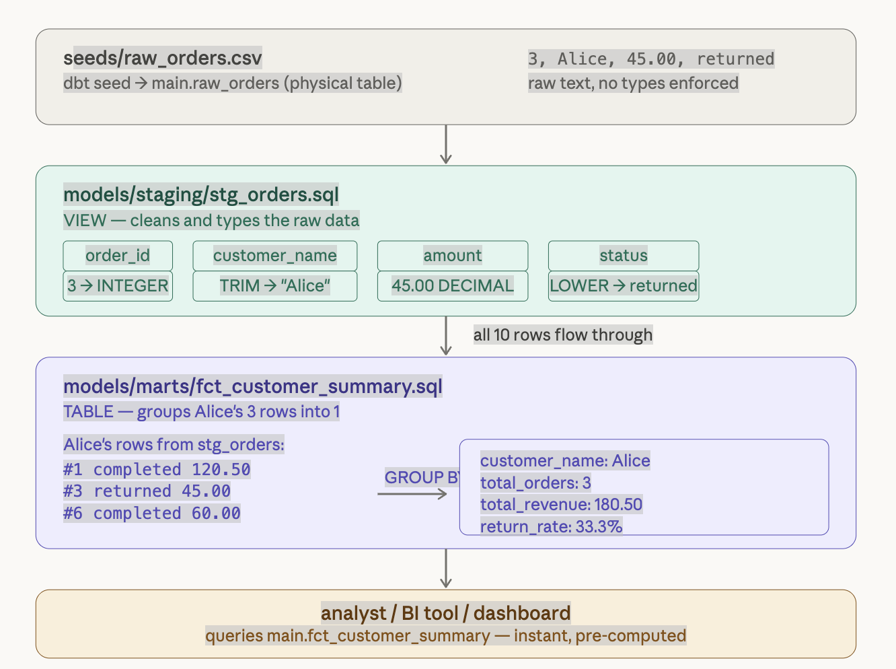

# learning_dbt

A minimal dbt learning project using **dbt Core** and **DuckDB**. Built to understand the core concepts of dbt from first principles: seeds, models, materializations, tests, and the DAG.

---

## What this project does

Takes 10 rows of synthetic e-commerce order data and transforms it through two layers — staging and marts — into a clean customer summary table with revenue and return metrics.

```
seeds/raw_orders.csv          10 rows, plain text
        ↓  dbt seed
main.raw_orders               physical table in DuckDB
        ↓  stg_orders.sql
main.stg_orders               view — typed and cleaned
        ↓  fct_customer_summary.sql
main.fct_customer_summary     table — one row per customer, business metrics
```

---

## Data journey: how a single row travels through the pipeline


</img>

---

## Final output

```sql
SELECT * FROM main.fct_customer_summary;
```

| customer_name | total_orders | total_revenue | total_returned | return_rate_pct |
|---------------|--------------|---------------|----------------|-----------------|
| Diana         | 2            | 549.99        | NULL           | 0.0             |
| Bob           | 3            | 399.75        | 25.00          | 33.3            |
| Charlie       | 2            | 200.00        | 15.00          | 50.0            |
| Alice         | 3            | 180.50        | 45.00          | 33.3            |

---

## Project structure

```
learning_dbt/
├── dbt_project.yml              # project config and materialization settings
├── seeds/
│   └── raw_orders.csv           # 10 rows of synthetic order data
├── models/
│   ├── staging/
│   │   ├── stg_orders.sql       # cleans and types raw_orders → view
│   │   └── schema.yml           # tests: unique, not_null, accepted_values
│   └── marts/
│       └── fct_customer_summary.sql   # aggregates by customer → table
└── tests/
```

---

## Core dbt concepts covered

| Concept           | Where used                                      |
|-------------------|-------------------------------------------------|
| Seeds             | `raw_orders.csv` loaded with `dbt seed`         |
| Staging model     | `stg_orders.sql` — view, type casting, cleaning |
| Mart model        | `fct_customer_summary.sql` — table, aggregations|
| Materializations  | `view` for staging, `table` for marts           |
| `{{ ref() }}`     | links models, builds the DAG automatically      |
| Generic tests     | `unique`, `not_null`, `accepted_values`          |
| DAG               | `raw_orders → stg_orders → fct_customer_summary`|

---

## Setup

### Prerequisites

- Python 3.10+
- [Miniconda](https://docs.conda.io/en/latest/miniconda.html) or virtualenv
- [DuckDB CLI](https://duckdb.org/docs/installation/) (optional, for direct querying)

### Install

```bash
# create and activate environment
conda create -n myenv python=3.10
conda activate myenv

# install dbt with DuckDB adapter
pip install dbt-duckdb
```

### Configure connection

Create `~/.dbt/profiles.yml`:

```yaml
learning_dbt:
  target: dev
  outputs:
    dev:
      type: duckdb
      path: "learning_dbt.duckdb"
      threads: 1
```

### Run

```bash
cd learning_dbt

# test connection
dbt debug

# build everything: seed + models + tests
dbt build
```

### Query results

```bash
duckdb learning_dbt.duckdb
```

```sql
SELECT * FROM main.fct_customer_summary;
```

---

## Test results

```
PASS=9  WARN=0  ERROR=0  SKIP=0  TOTAL=9
```

All 6 data tests pass:
- `unique` and `not_null` on `order_id`
- `accepted_values` on `status` (`completed`, `returned`)
- `not_null` on `amount`
- `unique` and `not_null` on `customer_name`

---

## Tech stack

- [dbt Core](https://docs.getdbt.com/) 1.11.7
- [dbt-duckdb](https://github.com/duckdb/dbt-duckdb) 1.10.1
- [DuckDB](https://duckdb.org/) (local, file-based)
- Python 3.10
